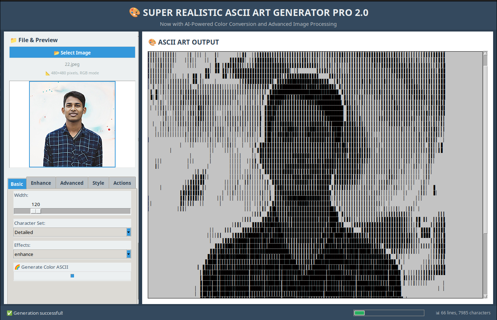

🎨 Super Realistic ASCII Art Generator Pro 2.0
An advanced, feature-rich desktop application for converting images into high-quality ASCII art, now with full color support. This tool provides a wide array of customization options, from intelligent background removal to multiple character sets and image enhancement filters, giving you complete control over the final output.

✨ Key Features
🌈 Full Color ASCII Art: Generate ASCII art that retains the original colors of the source image.

🖼️ Real-time Preview: See a live preview of your image as you adjust the settings.

🤖 AI-Powered Background Removal: Intelligently detect and remove the background from your images.

🗂️ Tabbed & Scrollable UI: A clean, organized, and user-friendly interface that is easy to navigate.

🎨 Advanced Image Processing:

Adjust brightness, contrast, sharpness, and saturation.

Apply pre-processing effects like Enhance, Smooth, Edge Detection, and more.

Utilize adaptive mapping and dithering for superior gradient representation.

🔧 Extensive Customization:

Choose from multiple character sets including Detailed, Classic, Blocks, Lines, Dots, and Braille.

Fine-tune the output with options for double-width characters, spacing, color reversal, and borders.

💾 Multiple Export Options: Save your creations as plain text (.txt), HTML (.html), or Markdown (.md) files.

📋 Clipboard Support: Instantly copy your ASCII art to the clipboard.

📦 Zero Heavy Dependencies: The application is built with standard Python libraries and Pillow, making it lightweight and portable.

⚙️ Requirements
To run this application, you need Python 3 and the following libraries:

Pillow: The Python Imaging Library (Fork) for image manipulation.

NumPy: A library for numerical operations.

You can install them using pip:

pip install Pillow numpy

🚀 How to Run
Make sure you have Python 3 and the required libraries installed.

Save the code as a Python file (e.g., ascii_art_generator.py).

Run the file from your terminal:

python ascii_art_generator.py

📖 How to Use: A Detailed Guide
This guide walks you through the various features available in each tab of the control panel.

1. Loading Your Image
Click the 📂 Select Image button to open a file dialog.

Choose any common image format (PNG, JPG, BMP, etc.).

Once loaded, you will see the image dimensions and color mode, along with a preview of the image that will be processed.

2. Basic Settings Tab
This tab contains the most fundamental controls for your ASCII art.

Width: Controls the width of the final ASCII art in characters. Larger values produce more detailed but larger outputs.

Character Set: Choose the set of characters used to render the image. Each set provides a different aesthetic (see the "Character Sets" section below).

Effects: Apply a pre-processing filter to the image before conversion. This can dramatically change the style. For example, edge will create an outline effect.

🌈 Generate Color ASCII: This is the main switch between monochrome and color output.

Checked: The generator will sample colors from the image and apply them to the ASCII characters.

Unchecked: The generator will produce classic monochrome ASCII art.

3. Enhance Tab
Fine-tune the visual properties of the source image before it's converted.

Brightness: Makes the image lighter or darker.

Contrast: Increases or decreases the difference between light and dark areas.

Sharpness: Enhances the definition of edges in the image.

Saturation: (Only affects Color ASCII) Boosts or mutes the intensity of the colors.

4. Advanced Tab
This tab offers powerful tools for more complex image manipulation.

Remove Background: When checked, the app tries to intelligently remove the background.

BG Threshold: Controls the sensitivity of the background detection. Higher values remove more.

BG Feather: Smooths the edges where the background was removed for a less jagged look.

Adaptive Mapping: Uses histogram equalization to improve contrast, which can bring out details in washed-out or overly dark images.

Dithering: Simulates more shades of gray (or color) by mixing characters, resulting in smoother gradients and less banding.

Aspect Correction: Compensates for the fact that terminal characters are typically taller than they are wide, preventing the output from looking stretched.

Smart Background: For transparent images (like PNGs), this will automatically choose a contrasting background color to ensure the subject is visible.

5. Style Tab
Control the final formatting and style of the text output.

Grayscale Mode: (For monochrome only) Determines how the image is converted to grayscale. weighted is usually the most visually accurate.

Double Width: Makes each character in the output twice as wide, which can be useful for certain fonts.

Add Spacing: Inserts a space between every character, creating a more spread-out look.

Reverse Colors: Inverts the brightness mapping. Dark areas of the image will be represented by dense characters, and light areas by sparse characters.

Add Border: Draws a border around the entire ASCII art output.

HTML Theme: When you save the art as an HTML file, this determines the background and text color theme.

6. Actions Tab
Once you've configured your settings, use this tab to generate and export your work.

🔄 Regenerate ASCII: Click this any time you change a setting to see the updated result.

💾 Save to File:

.txt: Saves as a plain text file.

.html: Saves as a web page. If "Generate Color ASCII" is on, the HTML file will be in full color.

.md: Saves as a Markdown file, with the ASCII art inside a code block.

📋 Copy to Clipboard: Copies the plain text version of the art to your clipboard.

🔄 Reset Settings: Resets all options in all tabs back to their default values.

📝 Character Sets
The generator includes a variety of character sets to achieve different visual styles:

Name

Characters

Detailed

█▉▊▋▌▍▎▏ 

Classic

@%#*+=-:. 

Blocks

██▓▒░ 

Lines

≡+=:-. 

Dots

●◐◑◒◓○⚬⚪ 

Braille

⣿⣾⣽⣻⣟⣯⣷⣶⣴⣲⣱⣰⣠⣀ 

📄 License
This project is licensed under the MIT License. See the LICENSE file for details.
